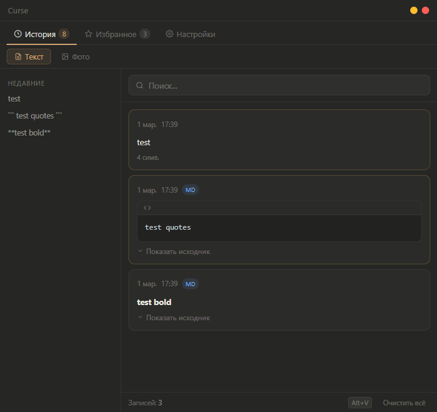
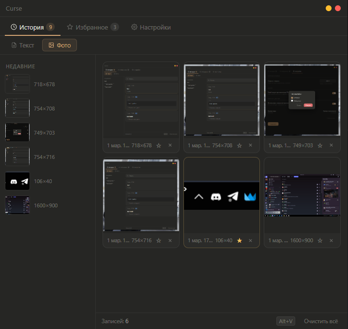
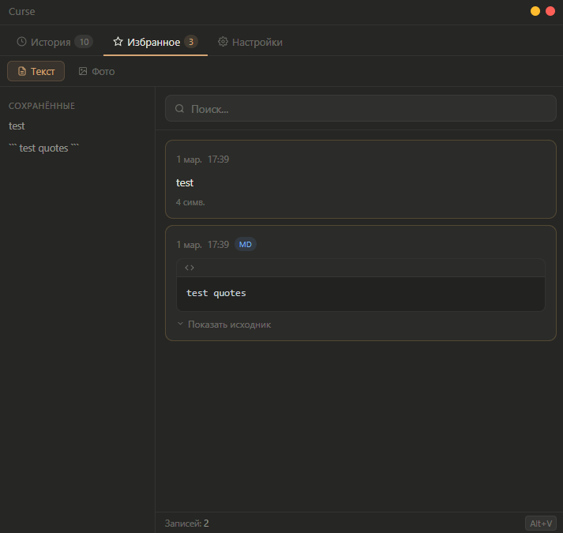
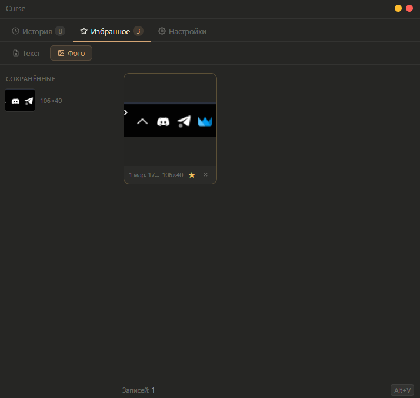
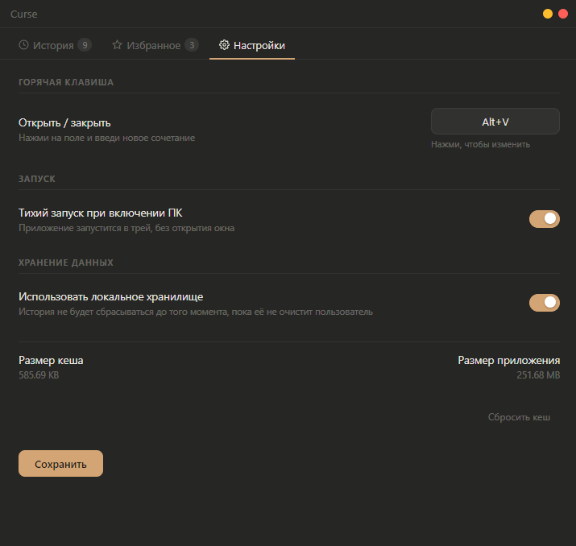

<div align="center">


# Curse

**Clipboard Manager for Windows x64**  
Manage your clipboard comfortably. The app saves a complete copy history, allows you to add items to favorites, and supports displaying items in Markdown format. 


</div>

---

## Screenshots

<div align="center">
  
  
  
  
  <br>
  
</div>

---

## Features

**Clipboard History** — automatically stores up to 100 recent entries with quick access  

**Favorites** — create a collection of important items with the ability to add notes  

**Search** — real-time text filtering of all entries  

**Markdown** — render formatted text with the ability to switch to source code view  

**Hotkey** — customizable keyboard shortcut to show/hide the application window  

**Background Mode** — starts in system tray without opening the window, minimizes to tray on close  

---

## Installation

### Requirements
- Node.js version 18 or higher

### Run from source

```bash
git clone https://github.com/crppst/Curse.git
cd Curse
npm install
npm start
